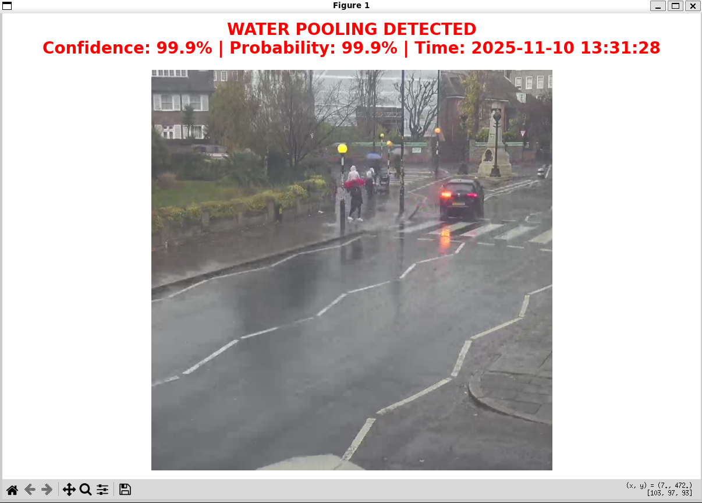

# Live CCTV Flood Detection with ResNet
## About the project
This project aims to solve the challenge set by the Met Office's Flood Forecasting Centre at the Hatch:IT Competition: Using existing distributed networks to aid real-time flood detection and damage assessment.

We propose utilising existing CCTV camera feeds, which can be available publicly, privately or by partnering with enterprises. Subsequently, we developed this prototype - a computer vision model trained to detect collecting water on road surfaces in real time from a constant, dynamic feed of CCTV footage. The demo CCTV in use here is live from the Abbey Road crossing in London:

 
 

## Training data
Training data was obtained from the following Kaggle datasets

[BDD100K](https://www.kaggle.com/datasets/solesensei/solesensei_bdd100k)

[FloodIMG](https://www.kaggle.com/datasets/hhrclemson/flooding-image-dataset)

## Model Performance
The ResNet vision model was trained on extremely simple data, only as a proof of concept for the proposed system. For deployment, we recommend obtaining training images and labels from the cctv cameras themselves, or utilising more advanced methods such as image segmentation models.
